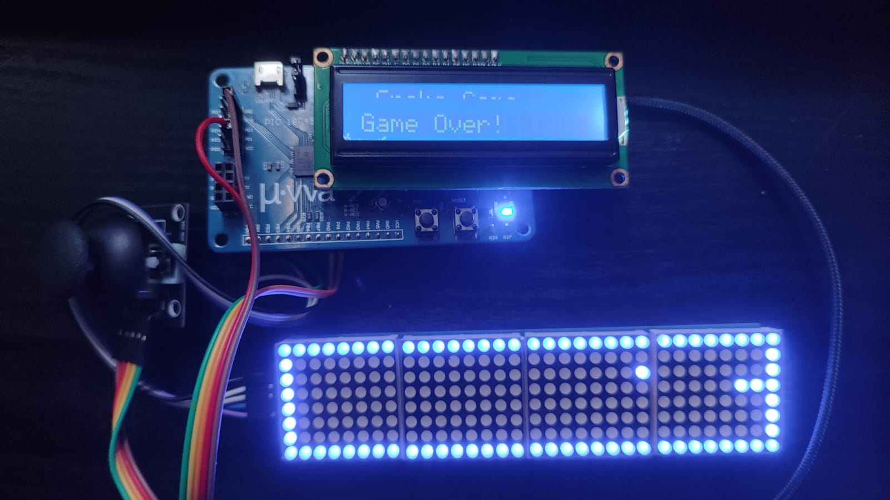

# 🐍 Snake Game on 8x32 LED Matrix with PIC18F4550

<div align="center">
  
</div>

## 📖 Description
Implementation of the classic "Snake" game using a daisy-chained LED matrix setup driven by MAX7219 controllers. The communication is handled via software SPI (bit-banging) from a PIC18F4550 microcontroller. The system features an input interface based on an analog joystick to control the snake's direction, read through the microcontroller's ADC module, alongside a 16x2 LCD screen for game state messages.

<div align="center">
  
</div>

## Bill of Materials (BOM)
* 1x PIC18F4550 Microcontroller (Tested on Miuva development board)
* 1x Microcontroller Programmer (e.g., PICkit 3 / PICkit 4) (just in case it is not included in your DevKit)
* 4x 8x8 LED Matrix modules with MAX7219 driver (forming an 8x32 display, or buying the 8x32 itself)
* 1x Analog Joystick (X/Y axis potentiometers)
* 1x 16x2 LCD Display 
* 1x Push-button (for Hardware Reset)
* 1x 5V DC Power Supply
* Quartz crystal oscillator and ceramic capacitors (Standard 20MHz setup)

## Low-Level Configuration & Fuses
This project relies on specific hardware configurations defined in the firmware to ensure smooth gameplay and rendering:

* **Clock Speed (`HSPLL`, `CPUDIV1`):** The microcontroller is configured to run at its maximum speed of 48 MHz using the internal PLL. This high clock rate is mandatory to execute the software SPI (bit-banging) and refresh the display buffer quickly enough to prevent visual flickering on the LED matrix.
* **Hardware Reset (`MCLR`):** The Master Clear feature is enabled. A physical push-button with a 10k pull-up resistor is connected to the `RE3/MCLR` pin. Pressing this button grounds the pin, performing a hard reset on the microcontroller, effectively acting as a "Restart Game" button without needing to cycle the power.
* **Watchdog Timer (`NOWDT`):** Disabled to prevent the microcontroller from auto-resetting during normal game loops.
* **Low-Voltage Programming (`NOLVP`):** Disabled to free up `PORTB` pins (specifically RB5) for standard digital I/O, which is required for the MAX7219 communication lines.

## Hardware Connections (Pinout)

**LED Matrix (MAX7219) - Software SPI**
* `PIN_B0` ➔ `DIN` (Data In)
* `PIN_B1` ➔ `CLK` (Clock)
* `PIN_B2` ➔ `CS` / `LOAD` (Chip Select)

**Analog Joystick (ADC)**
* `AN0` (RA0) ➔ Joystick X-Axis
* `AN1` (RA1) ➔ Joystick Y-Axis

**System**
* `PIN_E3` ➔ Hardware Reset Button (MCLR)

*Note: For complete LCD wiring and detailed hardware topology, please refer to the schematic provided in the `/docs` folder.*

## 📁 Repository Structure

```text
SNAKE-PIC18F4550-MAX7219/
│
├── binaries/
│   └── snake_game_PIC18F4550.hex    # Compiled file ready to flash
│
├── docs/
│   ├── snake_game_schematics.bmp    # Proteus schematic diagram
│   ├── snake_game_video.mp4         # Raw demo video
│   ├── snake_game_working.jpg       # Hardware setup photo
│   └── snake_game.gif               # Gameplay demonstration
│
├── firmware/
│   ├── 18F4550.h                    # PIC18F4550 definitions
│   ├── MLCD.c                       # Custom 16x2 LCD driver library
│   ├── snake_game.c                 # Main game logic and SPI drivers
│   └── snake_game.ccspjt            # CCS C Compiler project file
│
├── hardware/
│   └── snake_game.pdsprj            # Proteus simulation file
│
├── .gitignore
└── README.md                        # This documentation file
```
## Software Requirements
* **Compiler:** [CCS PIC C Compiler](https://www.ccsinfo.com/) (v5.112 or similar)
* **Simulation:** Proteus Design Suite
* **Flashing Tool:** MPLAB X IPE (or PICkit standalone software)

## How to Build and Run
1. Clone this repository to your local machine.
2. Navigate to the `/firmware` folder and open the `snake_game.ccspjt` project file using CCS C Compiler.
3. Compile the `snake_game.c` file to generate a fresh `.hex` file. Alternatively, you can use the pre-compiled binary found in the `/binaries` folder.
4. Open your flashing software (like MPLAB X IPE) and connect your **PICkit** programmer to the microcontroller.
5. Flash the `.hex` file onto your PIC18F4550.
6. Assemble the hardware based on the pinout section and the schematic provided in `/docs`.
7. Power the system with 5V, move the joystick to start playing, and press the MCLR button to restart after a Game Over!

## Author
**Martin Farid Carrasco Gómez** Mechatronics Engineering Student